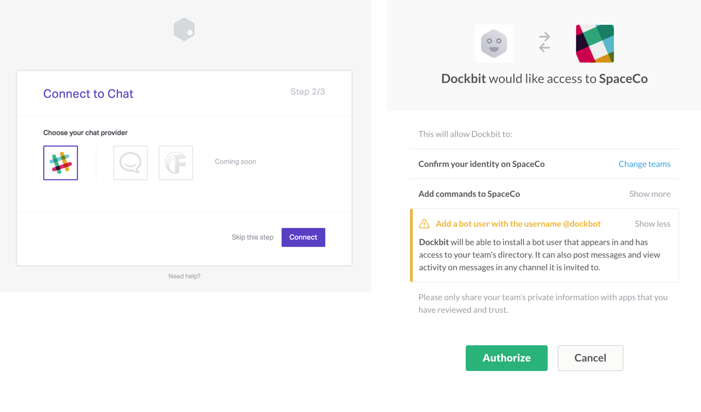
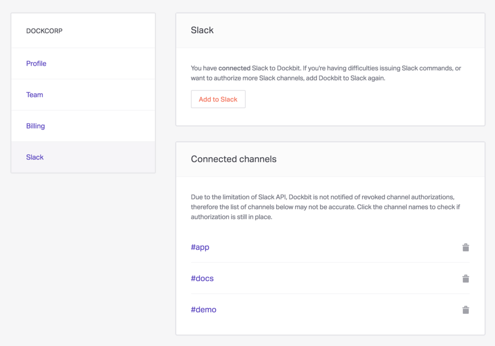
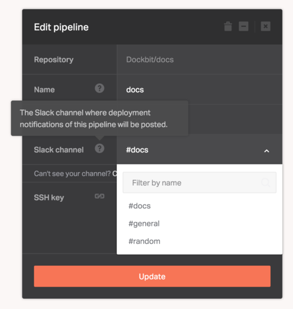

Slack is one of the [supported chat systems](/chats) in Dockbit. It's used as the primary interface to operate Dockbit Pipelines from within your team chat, enabling anyone on your team to deploy with a single chat command.

## Connecting Slack

After you've signed up and created your Dockbit Team, you will be presented with the list of chat providers. Choosing Slack logo and clicking **Connect** will send your browser to the Slack site, where you will need to choose your team and authorize [Dockbit Slack Application](https://slack.com/apps/A0FLBC3JQ-dockbit). If you've skipped connecting Slack during your onboarding process, you can always re-connect again by going to your **Team Settings**, choosing **Slack** section and clicking on the **Add to Slack** button.

You can now type `/dockbit help` command in your team chat and it will tell you everything you can do with Dockbit.

## Authorizing Slack Channels

Dockbit uses [Slack Channels](https://get.slack.help/hc/en-us/articles/201402297-Create-a-channel) to send notifications about your team deployments. In order to authorize Slack Channels, navigate to your **Team Settings**, choose **Slack** section and click **Add to Slack**. This is also useful if you ever changed permissions on the Slack side and want to re-initiate the connection.

## Configuring Pipeline Slack Channel

Once you've authorized Slack Channels, you can choose one of them in the Pipeline settings. Dockbit will then send all the notifications related to this pipeline to the configured Slack channel.

