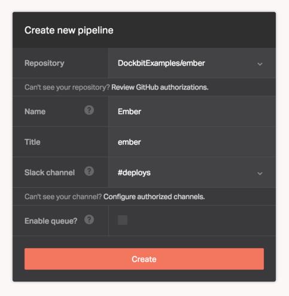
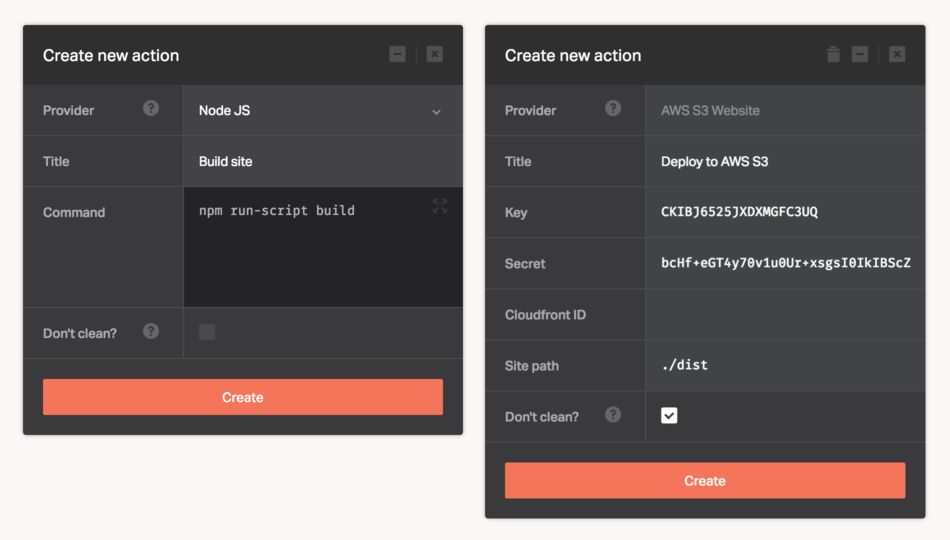
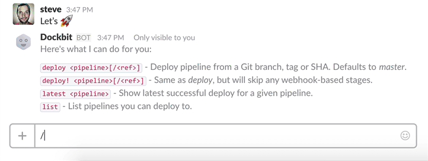

Below you will find guides and tutorials that will teach you how to use Dockbit and related systems. The documentation site is still work in progress, so if you find anything inaccurate, misleading or just missing, please [open an issue](https://github.com/Dockbit/docs/issues/new) or [contribute](https://github.com/Dockbit/docs/blob/master/CONTRIBUTING.md).

## What is Dockbit?

Dockbit is the continuous delivery platform built for teams. It integrates with all the tools you're using to deliver software, lets you connect them together and operate deployments from within your team chat (see [Supported Chat Systems](/chats)).

## How does it work?

At the core of Dockbit is the _Pipeline_, which is a common term to describe a Continuous Delivery [deployment pipeline](https://en.wikipedia.org/wiki/Continuous_delivery#Deployment_pipeline). Essentially, Pipeline is a single app backed by a [Git](https://git-scm.com/) repository (see [Supported Version Control Systems](/vcs)).

Pipeline consists of a number of stages, powered by Dockbit's [Integrations](/integrations), necessary to validate a piece of software from source control all the way through production.

## Step-by-step

To get you started, let us walk you through creating a sample deployment pipeline for an [Example Ember.js application](https://github.com/DockbitExamples/ember) and deploy it to [AWS](../integrations/aws-s3-website), along with any intermediary steps necessary to build and verify our application. We assume you've already [signed up](https://dockbit.com) and created your Dockbit Team.

Before creating any pipeline, it's beneficial to think a bit of the steps involved, which are in our case:

  * Pull Git repository with the source code.
  * Install Node.js and Bower application dependencies.
  * Build static site.
  * Deploy to AWS S3.

### 1. Create pipeline

Creating a Dockbit Pipeline is easy, but we will need a sample application. If you want to follow along, fork our [Example Ember.js GitHub repository](https://github.com/DockbitExamples/ember).

All you need to do now, is to click on the **Create pipeline** button in the top navigation, choose the forked repository and click **Create**:

  * The **Name** uniquely identifies this pipeline in your Team. It is also referenced in the [Slack](../chats/slack) chatbot when triggering deployments.
  * The **Slack channel** is one of the channels you've [authorized Dockbit](../chats/slack) for during the onboarding process. It is used to receive deployment notifications.

Once the pipeline is created, Dockbit [automatically sets up the GitHub](../vcs/github) _deployment key_ and the _webhook_. As you may have noticed, the first step in the pipeline is preconfigured, which is there to pull any change in your repository.

### 2. Add stages

Now, we are ready to add the steps necessary to build, verify and deploy our application. Click on the _plus_ icon in the Pipeline Editor and choose **Action** to bring up the integration form. To deploy our Ember.js application we will create two Dockbit Stages.

First, to build the static site with [Node.js provider](../integrations/node) and second to deploy it with [AWS s3_website provider](../integrations/aws-s3-website). Fill up the Stage details as shown below and also remember to enter your own [AWS access keys](https://aws.amazon.com/developers/access-keys/).

Notice how we didn't need to install our app dependencies, nor configure credentials. The [Dockbit Integrations](../integrations) are smart enough to detect and automatically configure them for us.

### 3. Deploy from Slack

It's time to deploy, right from Slack! Open up the Slack channel you've authorized Dockbit for, instruct the Dockbit chatbot to deploy, and sit back-n-watch what happens.

Yay! We now have a fully-automated deployment pipeline entirely operated via Slack 🤖

## What is next?

Now that you have a taste of how to deploy your apps with Dockbit, there are a bunch of other exciting things you could do with it. Explore our evergrowing collection of [Dockbit Integrations](../integrations) and extend your deployment process with testing, code analysis, and assessing security vulnerabilities. Or power up your pipelines with even more [Dockbit Features](https://dockbit.com/features), such as Auto Deploys, Deployment Queues, and Metrics. Happy shipping 🚀

