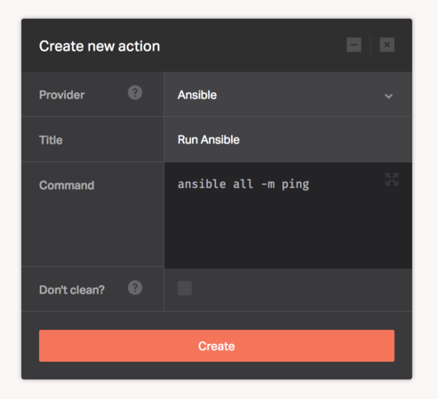

[Ansible](https://www.ansible.com/) is a radically simple IT automation engine that automates cloud provisioning, configuration management, application deployment, intra-service orchestration, and many other IT needs.

The Ansible provider lets you use Ansible to automate and manage your systems as part of your pipeline.

There's no configuration required for this provider, you only need to supply the Ansible commands needed to deploy your application.

```
ansible all -m ping
```



## Did you know?

If you're using [Ansible Ad-Hoc commands](http://docs.ansible.com/ansible/intro_adhoc.html), make sure to specify the path to inventory host file within your working directory.

```
ansible-playbook myplaybook.yml
```
