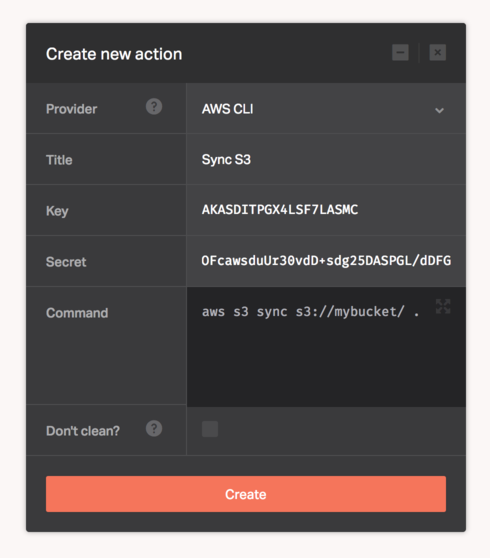

[AWS CLI](https://aws.amazon.com/cli/) is a unified tool to manage your AWS services. When added to the pipeline, you can control multiple [AWS services](https://aws.amazon.com/) and automate them through scripts.

The [AWS CLI](https://aws.amazon.com/cli/) also introduces a new set of simple file commands for efficient file transfers to and from [Amazon S3](https://aws.amazon.com/s3/).

Before you can start using the AWS CLI integration, you must sign up for an [AWS account](http://docs.aws.amazon.com/cli/latest/userguide/cli-chap-getting-set-up.html#cli-signup). Once you acquire an AWS account, the integration will minimally need the following credentials to connect to your AWS services. Fill them in the Dockbit Stage configuration:

* ```Key``` -  AWS access key
* ```Secret``` - AWS access secret key


For more information about acquiring your credentials, please visit the official AWS documentation: [Managing Access Keys for your AWS Account](http://docs.aws.amazon.com/general/latest/gr/managing-aws-access-keys.html).

Additionally, if you'd like to set extra attributes, you can do so in the Dockbit [Pipeline Variables](/using-dockbit/variables) and the CLI will inherit them. You can follow the official documentation for the full list of [environmental variables](http://docs.aws.amazon.com/cli/latest/userguide/cli-chap-getting-started.html#cli-environment) supported.


