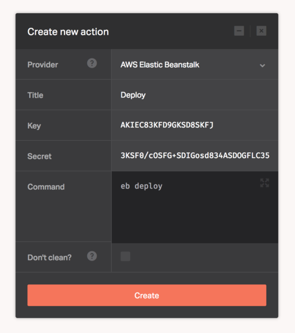

With [AWS Elastic Beanstalk](https://aws.amazon.com/documentation/elastic-beanstalk/) you can quickly deploy and manage applications in the AWS cloud without worrying about the infrastructure that runs those applications. AWS Elastic Beanstalk reduces management complexity without restricting choice or control. You simply upload your application, and AWS Elastic Beanstalk automatically handles the details of capacity provisioning, load balancing, scaling, and application health monitoring.

This provider lets you use AWS Elastic Beanstalk CLI to deploy and manage applications in AWS Cloud.

Before you can start using the AWS Elastic Beanstalk provider, you must sign up for the [service](http://docs.aws.amazon.com/elasticbeanstalk/latest/dg/GettingStarted.html#GettingStarted.Walkthrough.Signup).

Once you acquire an account, the provider will need the following credentials to connect to your AWS services. Fill them in the Dockbit Stage configuration:

* ```Key``` - AWS access key
* ```Secret``` - AWS access secret key


The credentials will be preconfigured automatically for the AWS EB CLI.


