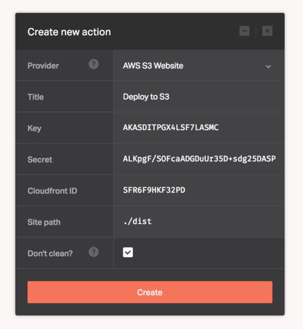

[s3_website](https://github.com/laurilehmijoki/s3_website) helps you manage an S3 website: sync, deliver via CloudFront, benefit from advanced S3 website features

What [s3_website](https://github.com/laurilehmijoki/s3_website) can do:

  * Create and configure an S3 website for you
  * Upload your static website to AWS S3
  * Jekyll, Nanoc, and Middleman are automatically supported
  * Help you use AWS Cloudfront to distribute your website
  * Improve page speed with HTTP cache control and gzipping
  * Set HTTP redirects for your website

This provider lets you use [s3_website](https://github.com/laurilehmijoki/s3_website) to deploy your website to Amazon S3.

Configuring the S3 website provider requires the following AWS credentials, as well as the deployment-related parameters:

* ```Key``` - AWS access key
* ```Secret``` - AWS access secret key
* ```Cloudfront ID``` - Cloudfront distribution ID
* ```Site path``` - The output directory within your repository


The _Key_ and _Secret_ attributes are exported as `DOCKBIT_AWS_S3_WEBSITE_KEY`, `DOCKBIT_AWS_S3_WEBSITE_SECRET`, and `DOCKBIT_AWS_S3_WEBSITE_CLOUDFRONT_ID` environment variables, so please make sure to use them in your `s3_website.yml` file.



## Did you know?

* Dockbit uses the `s3_website cfg` and `s3_website push` commands to configure the attributes supplied to the provider.
* You can use ERB format in your [s3_website.yml](https://github.com/laurilehmijoki/s3_website#using-environment-variables) to incorporate the Dockbit [Pipeline Variables](/using-dockbit/variables).
