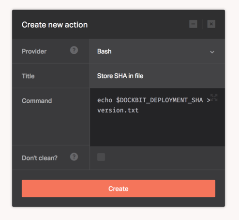

[Bash](https://www.gnu.org/software/bash/) is the Bourne Again SHell. Bash is an sh-compatible shell that incorporates useful features from the Korn shell (ksh) and C shell (csh)

The [Bash](https://www.gnu.org/software/bash/) provider lets you execute any [Bash](https://www.gnu.org/software/bash/) script within your repository or arbitrary command.

There's no configuration required for this provider, you only need to supply the shell commands needed to deploy your application.

```
echo $DOCKBIT_DEPLOYMENT_SHA > version.txt
```


