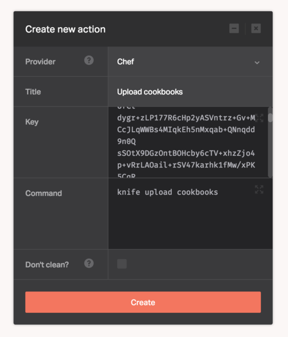

[Chef](https://www.chef.io/chef/) is an open source software agent that automates your infrastructure by turning it into code. That infrastructure becomes dynamic, versionable, human-readable, and testable.

[Knife](https://docs.chef.io/knife.html) is a command line tool that provides an interface between a local Chef repository and the Chef server.

The Chef provider allows you to execute any `knife` commands as part of your pipeline.

You'll need to supply a [knife.rb](https://docs.chef.io/config_rb_knife.html) configuration file in your repository under `.chef/knife.rb`. We provide an example in the [Chef examples repo](https://github.com/DockbitExamples/chef/blob/master/.chef/knife.rb).

Configuring the Chef provider also requires a Chef admin client private key as mentioned in the [official documentation](https://docs.chef.io/knife_configure.html) for Knife. The private key is stored on disk at `$HOME/.chef/client.pem`.

Once you have the private key, fill it in the Dockbit Stage configuration:

* ```Key``` - Chef admin client key

You can then execute any Knife commands to run as part of your pipeline.

```
knife upload cookbooks
```


