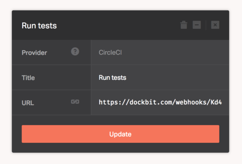

[CircleCI](https://circleci.com) helps your team focus on making a great product. Speed up your test and development cycle to improve productivity without requiring one or more engineers to maintain your build and test setup.

When added to the pipeline, Dockbit deployments will require a successful build status reported to it's Webhook endpoint to proceed. Therefore, we'll need to configure CircleCI to send payload to the Dockbit generated unique URL.

Assuming you've created CircleCI stage and copied Webhook URL, add the following configuration to your ```circle.yml``` file, which will instruct CircleCI to send a [Webhook notification](https://circleci.com/docs/configuration#notify) to Dockbit:

```
notify:
  webhooks:
    - url: <Paste Webhook URL you've copied from the Dockbit Stage>
```


