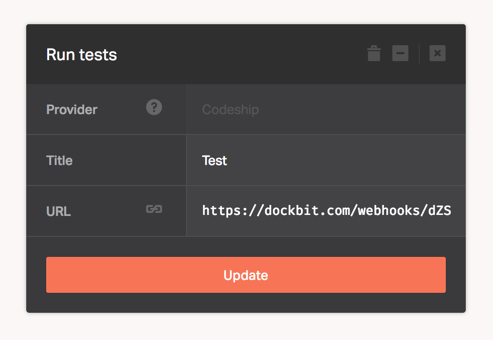

[Codeship](https://codeship.com) is a fully customizable hosted CI platform.

When added to the pipeline, Dockbit deployments will require a successful build status reported to it's Webhook endpoint to proceed. Therefore, we'll need to configure Codeship to send payload to the Dockbit generated unique URL.

Assuming you've created Codeship stage and copied Webhook URL, follow the [Codeship guide](https://documentation.codeship.com/general/account/notifications/#webhooks-for-custom-notifications) to set up a Dockbit webhook for your project:

