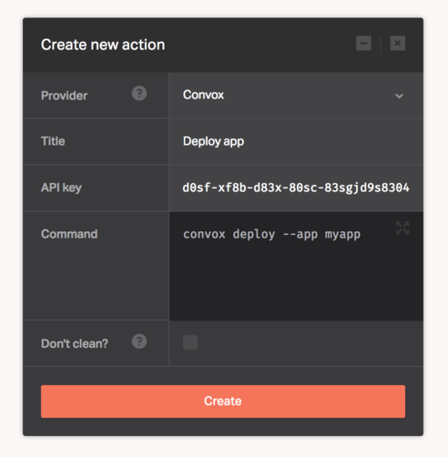

[Convox](https://convox.com/) is an open-source tool for deploying, managing, and monitoring applications on cloud infrastructure. it gives your developers single-command deploys for your apps, and simple ways to tune them for any scale.

Configuring the Convox provider only requires a Console API key, please refer to the [official documentation](https://convox.com/docs/api-keys/) for instructions on how to get your API key.

Once you have the key, fill it in the Dockbit Stage configuration:

* ```Key``` - Convox Console API key

You can then execute any Convox commands to run as part of your pipeline.

```
convox deploy --app myapp
```


