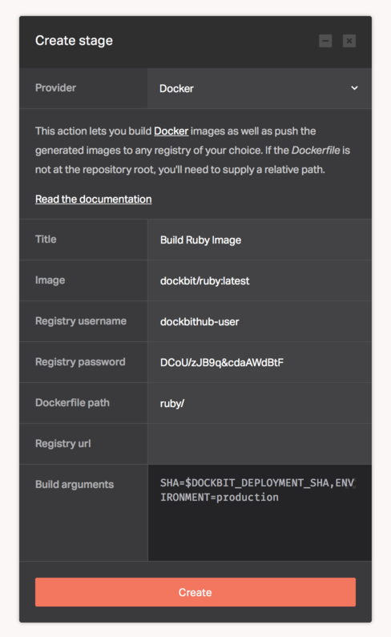

[Docker](https://www.docker.com) is an open-source project that automates the deployment of applications inside software containers. It's used by developers and sysadmins to build, ship, and run distributed applications, whether on laptops, data center VMs, or the cloud.

The Docker provider lets you build Docker images as a step in your pipeline. You can also push the generated images to the [Docker Hub](https://hub.docker.com) or any other private registry of your choice.

If you'd like to use the Docker provider to push images to the [Docker Hub](https://hub.docker.com), you'll need to supply the image name (with an optional image tag), your [Docker ID](https://docs.docker.com/docker-hub/#create-a-docker-id) user name, and password. The username and password pair is passed to the `docker login` command, please refer to the [official documentation](https://docs.docker.com/engine/reference/commandline/login/) for more information. Additionally, pushing to a private registry requires the registry URL to be supplied.

By default, the Docker provider looks for a [Dockerfile](https://docs.docker.com/engine/reference/builder/) at the root of your source code repository. If that's not the case, you can supply a relative path to the directory containing the Dockerfile inside the repository.

Below you can find the configuration that can be used in the Dockbit Stage:

* ```Image``` - Required - Docker Image name (can include organizations and tags)
* ```Registry username``` - Required - Docker Hub or Registry user name
* ```Registry password``` - Required - Docker Hub or Registry password
* ```Dockerfile path``` - Optional - Relative path to Dockerfile
* ```Registry url``` - Optional - Private registry URL



## Did you know?

Dockbit launches a completely separate virtual machine for Docker builds, ensuring exclusive access to the Docker daemon for enhanced security. The specifications of the virtual machine depends on the Dockbit [plan](../../using-dockbit/plans) applied to the account.
