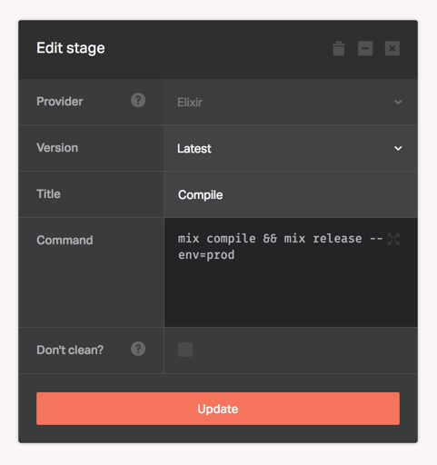

[Elixir](https://elixir-lang.org/) is a dynamic, functional programming language that leverages the [Erlang](../erlang) VM and designed for building scalable, maintainable applications.

Elixir provider lets you execute any Erlang or Elixir operation. There's no configuration required for this provider, you only need to supply the Elixir based commands needed to deploy your application.

## Elixir versions

The default version of Elixir is `1.4.5` based on [Erlang/OTP](../erlang) default.

We also have the following versions installed:

* 1.2.6
* 1.3.4

You can switch to any of them and activate using [Kiex](https://github.com/taylor/kiex) with one of the following methods:

* Set the value of the Elixir version in the Dockbit Pipeline variable named `ELIXIR_VERSION`.
* Set the value of the Elixir version in the `.elixir-version` file at the root directory of your repository.

## Did you know?

If Dockbit discovers that you have a `mix.lock` in your repository, it'll utilize [hacher](https://github.com/Dockbit/hacher) to cache your [Mix](https://hexdocs.pm/mix/Mix.html) dependencies for faster builds.
