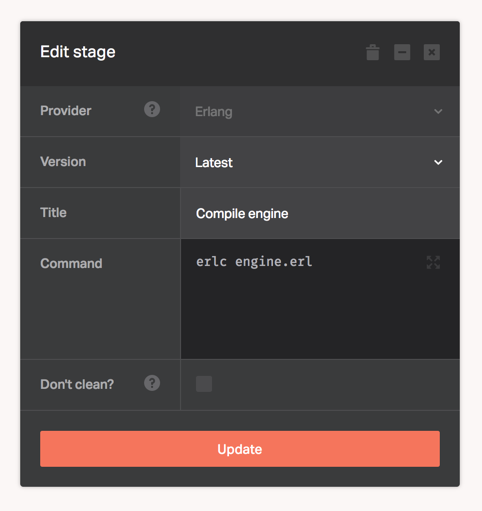

[Erlang](http://www.erlang.org/) is a general purpose, concurrent, functional programming language used to build massively scalable soft real-time systems with requirements on high availability.

Erlang provider lets you execute any Erlang operation. There's no configuration required for this provider, you only need to supply the Erlang based commands needed to deploy your application.

## Erlang versions

The default version of Erlang/OTP is `20.0`.

We also have the following versions installed:

* 19.3

You can switch to any of them and activate using [Kerl](https://github.com/kerl/kerl) with one of the following methods:

* Set the value of the Erlang version in the Dockbit Pipeline variable named `ERLANG_VERSION`.
* Set the value of the Erlang version in the `.erlang-version` file at the root directory of your repository.
