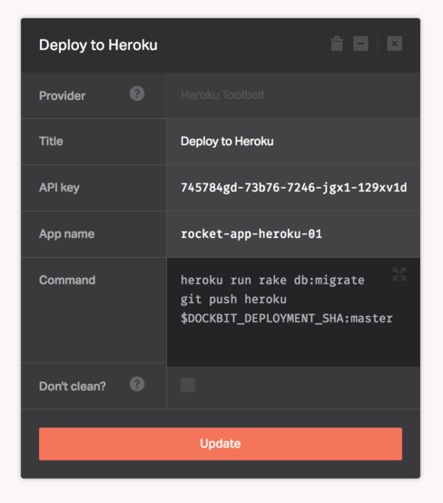

[Heroku](https://www.heroku.com/platform) is a cloud platform based on a managed container system, with integrated data services and a powerful ecosystem, for deploying and running modern apps. The Heroku developer experience is an app-centric approach for software delivery, integrated with today’s most popular developer tools and workflows.

The Heroku Toolbelt provider lets you use the [legacy Heroku Toolbelt](https://devcenter.heroku.com/articles/heroku-cli#legacy-ruby-cli) to deploy your pipeline. Within Dockbit you can also use the next generation Heroku CLI based on top of Node and Go, available as a [separate provider](../heroku-cli).

Configuring the Heroku Toolbelt provider requires an API Token and App name, please refer to the [official documentation](https://devcenter.heroku.com/articles/authentication#retrieving-the-api-token) for instructions on how to get your API key. If the provided App does not exist, it will be created.

Once you have the token and app the name, fill them in the Dockbit Stage configuration:

* ```API key``` - Heroku token
* ```App name``` - Heroku app name

Heroku Git remote and credentials are preconfigured automatically.

You can then execute any Heroku commands to run as part of your pipeline.

```
heroku run rake db:migrate
git push heroku $DOCKBIT_DEPLOYMENT_SHA:master
```



## Did you know?

Dockbit follows the [.netrc](https://devcenter.heroku.com/articles/authentication#api-token-storage) format for storing the API token for Heroku.
