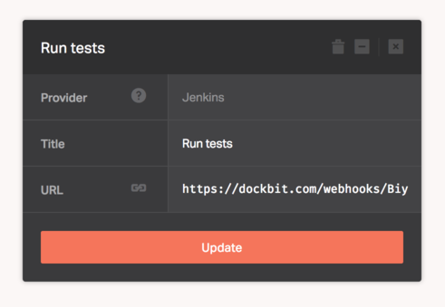

[Jenkins](https://jenkins-ci.org) is the leading open source automation server. Jenkins provides hundreds of plugins to support building, deploying and automating any project.

When added to the pipeline, Dockbit deployments will require a successful build status reported to it's Webhook endpoint to proceed. Therefore, we'll need to configure [Jenkins](https://jenkins-ci.org) to send payload to the Dockbit generated unique URL.

Assuming you've created Jenkins stage and copied Webhook URL, go to Jenkins and install [Notification Plugin](https://wiki.jenkins-ci.org/display/JENKINS/Notification+Plugin). Then, open the project you want to associate with Dockbit Pipeline and configure _Job Notifications_ endpoint:

* ```Format``` - JSON
* ```Protocol``` - HTTP
* ```Event``` - Job Completed
* ```URL``` - _Paste Webhook URL you've copied from the Dockbit Stage_.
* ```Timeout``` - 30000
* ```Log``` - Maximum 1000 lines, as that's the limit Dockbit processes.


