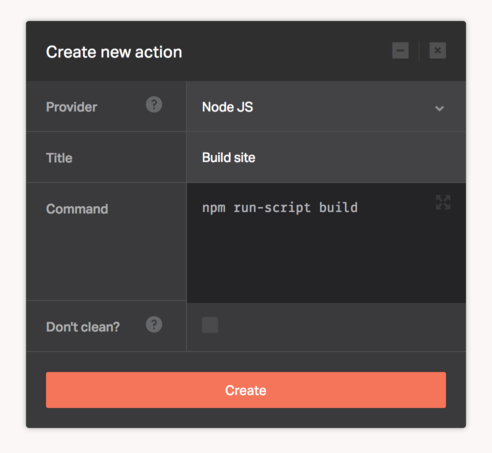

[Node.js](https://nodejs.org/) is a JavaScript runtime built on Chrome's V8 JavaScript engine. Node.js uses an event-driven, non-blocking I/O model that makes it lightweight and efficient. Node.js' package ecosystem, npm, is the largest ecosystem of open source libraries in the world.

The Node.js provider lets you execute any NPM [run-script](https://docs.npmjs.com/cli/run-script) based Node.js operation. Use it for such things as static site generation, code style analysis, asset compilation, or anything else as part of your deployment pipeline.

There's no configuration required for this provider, you only need to supply the `npm run-script` commands needed to deploy your application.

```
npm run-script build
```



## Node versions

The default version of Node.js is `6.11.3`.

We also have the following versions installed:

* 0.10.46
* 0.12.15
* 5.12.0
* 6.5.0
* 6.8.0
* 7.10.0
* 8.5.0

You can switch to any of them and activate using [NVM - Node Version Manager](https://github.com/creationix/nvm) by executing `nvm use <version>` before other commands.

## Yarn

As an alternative to NPM, Dockbit supports [Yarn](https://yarnpkg.com) package manager. If you want to use Yarn today, all you need is the `yarn.lock` at the root of your repository and Dockbit will automatically use Yarn instead of NPM. Then, just [run](https://yarnpkg.com/en/docs/cli/run) the script, for example:

```
yarn run ember build
```

## Did you know?

If Dockbit discovers that you have a `package.json` in your repository, it'll utilize [hacher](https://github.com/Dockbit/hacher) to cache your node/bower packages for faster builds.

In addition to the supported Node versions, Dockbit also supports [AVN](https://github.com/wbyoung/avn), allowing automatic switching to the node version defined in the `.node-version` file.
