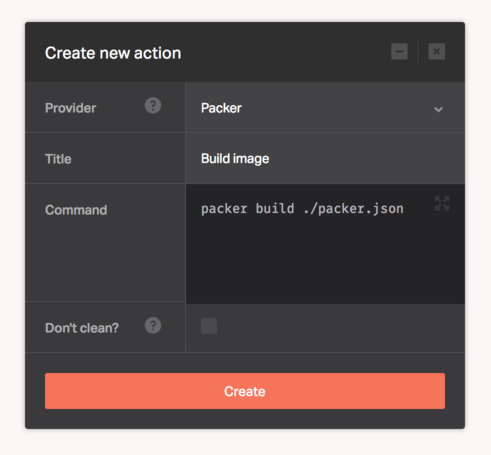

[Packer](https://www.packer.io/) is an open source tool for creating identical machine images for multiple platforms from a single source configuration. Packer is lightweight and highly performant, creating machine images for multiple platforms in parallel.

A machine image is a single static unit that contains a pre-configured operating system and installed software which is used to quickly create new running machines. Machine image formats change for each platform. Some examples include [AMIs](http://docs.aws.amazon.com/AWSEC2/latest/UserGuide/AMIs.html) for EC2, [Images](https://cloud.google.com/compute/docs/images) for GCE, etc.

Configuring the Packer provider depends solely on how you setup your [User Variables](https://www.packer.io/docs/templates/user-variables.html). Once you have the variables defined in your template, you can supply them as Dockbit [Pipeline variables](/using-dockbit/variables) and Packer will pick them up as part of the pipeline execution.

Please note that while Packer has support for building virtualization engines images like [VirtualBox's OVF](https://www.packer.io/docs/builders/virtualbox.html) exports or [VMDK/VMX files](https://www.packer.io/docs/builders/vmware.html) for VMware, we don't support building images for those systems within Dockbit since they'd need access to the virtualization hypervisors mentioned. You can still connect to your own servers with the hypervisors and run the Packer builds there.
