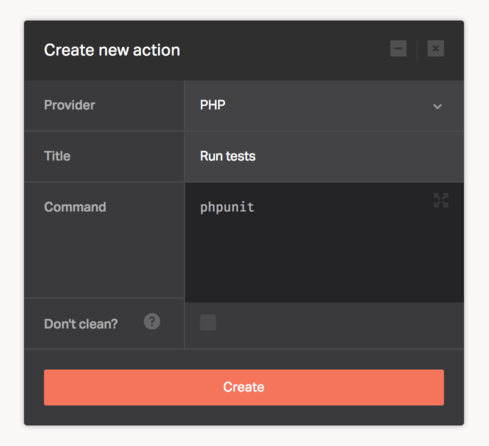

[PHP](https://php.net/) is a popular general-purpose scripting language that is especially suited to web development.

The [PHP](https://php.net/) provider lets you execute any PHP operation. The dependency management tool Composer is also available to use with this provider.

There's no configuration required for this provider, you only need to supply the PHP based commands needed to deploy your application.

```
phpunit
```



## PHP versions

The version of PHP used is `5.6.26`, we also have [composer](https://getcomposer.org/) version `1.2.1` installed.

## Did you know?

If Dockbit discovers that you have `composer.json` in your repository, it'll utilize [hacher](https://github.com/Dockbit/hacher) to cache your Packagist packages for faster builds.
