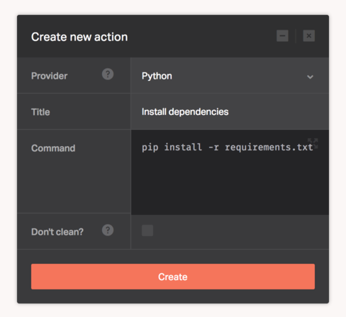

[Python](https://www.python.org/) is a programming language that lets you work quickly and integrate systems more effectively.

The [Python](https://www.python.org/) provider lets you execute any Python operation. Use it for such things as static site generation, code style analysis, asset compilation, or anything else you can imagine.

There's no configuration required for this provider, you only need to supply the Python based commands needed to deploy your application.

```
pip install -r requirements.txt
```



## Python versions

The version of Python used is `3.4.4`, we also have [pip](https://pypi.python.org/pypi/pip) version `8.1.1` installed.
