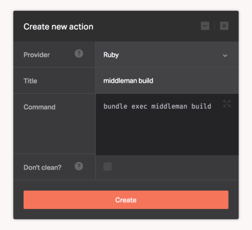

[Ruby](https://www.ruby-lang.org/) is a dynamic, open source programming language with a focus on simplicity and productivity. It has an elegant syntax that is natural to read and easy to write.

The Ruby provider lets you execute any [Bundler](http://bundler.io/) based Ruby operation. Use it for such things as static site generation, code style analysis, outdated Gems checks, or anything else you can imagine.

There's no configuration required for this provider, you only need to supply the bundle based commands needed to deploy your application.

## Ruby versions

The default version of Ruby is `2.3.1`.

We also have the following versions installed:

* 2.1.7
* 2.1.8
* 2.2.2
* 2.2.3
* 2.2.4
* 2.3.0

You can switch to any of them and activate using [Rbenv](https://github.com/rbenv/rbenv) with one of the following methods:

* Set the value of the Ruby version in the Dockbit Pipeline variable named `RBENV_VERSION`.
* Set the value of the Ruby version in the `.ruby-version` file at the root directory of your repository.

Dockbit follows Rbenv's official [loading order](https://github.com/rbenv/rbenv#choosing-the-ruby-version).

## Did you know?

If Dockbit discovers that you have a `Gemfile` in your repository, it'll utilize [hacher](https://github.com/Dockbit/hacher) to cache your Ruby Gems for faster builds.

