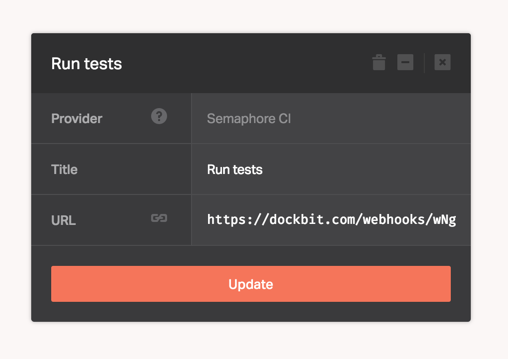

[Semaphore CI](https://semaphoreci.com) is hosted continuous integration and deployment service.

When added to the pipeline, Dockbit deployments will require a successful build status reported to it's Webhook endpoint to proceed. Therefore, we'll need to configure Semaphore CI to send payload to the Dockbit generated unique URL.

Assuming you've created Semaphore CI stage and copied Webhook URL, follow the [Semaphore CI guide](https://semaphoreci.com/docs/post-build-webhooks.html) to set up a Dockbit webhook for your project:

