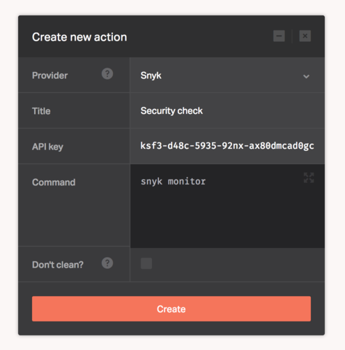

[Snyk](https://snyk.io/) helps you fix vulnerabilities through guided upgrades and patches, it catches vulnerable dependencies before they get deployed as well as alerts about newly disclosed vulnerabilities in your dependencies. Find more about it's features on the Snyk [website](https://snyk.io/features).

The Snyk provider allows you to find and fix known vulnerabilities in Node dependencies as part of your deployment pipeline.

Configuring the Snyk provider requires an API token as mentioned in the [official documentation](https://snyk.io/docs/using-snyk/#authentication). You can grab the token from your [account page](https://snyk.io/account) once you've authenticated to Snyk using your GitHub account.

Once you have the token, fill it in the Dockbit Stage configuration:

* ```API Key``` - Snyk API key

You can then execute any Snyk commands to run as part of your pipeline.

```
snyk monitor
```



## Did you know?

Dockbit consumes the API key internally and passes it to the `snyk auth` command.
