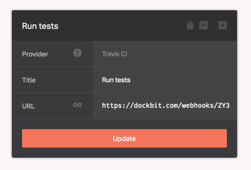

[Travis CI](https://travis-ci.com) lets you focus on writing code and it take care of running your tests and deploying your apps.

When added to the pipeline, Dockbit deployments will require a successful build status reported to it's Webhook endpoint to proceed. Therefore, we'll need to configure Travis CI to send payload to the Dockbit generated unique URL.

Assuming you've created Travis CI stage and copied Webhook URL, add the following configuration to your ```.travis.yml``` file, which will instruct Travis to send a [Webhook notification](http://docs.travis-ci.com/user/notifications/#Webhook-notification) to Dockbit:

```
notifications:
  webhooks:
    urls:
      - <Paste Webhook URL you've copied from the Dockbit Stage>
    on_success: always
    on_failure: always
    on_start: never
```


