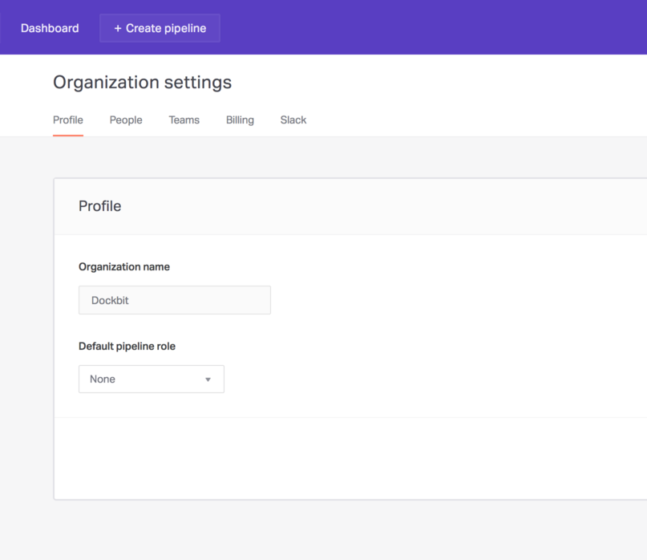
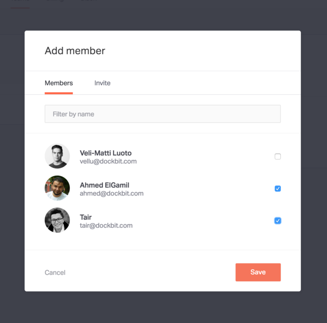
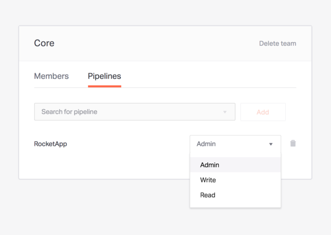

In order to enable teams and permissions, you'll need to first upgrade your plan to _Plus_. See our documentation on [Plans](../plans) to see how to do that.

## Organization memberships

Within an organization you have _admins_ and _members_. _Admins_ can do anything within their organization whereas _members_ have more limited access. See the table below to see how the access rights are distributed.

| Action                           | Admin | Member |
|----------------------------------|:-----:|:------:|
| View organization                | ✓     | ✓      |
| Update organization details      | ✓     |        |
| View organization members        | ✓     | ✓      |
| Update organization member roles | ✓     |        |
| Remove organization members      | ✓     |        |
| Invite people                    | ✓     |        |
| Edit billing information         | ✓     |        |
| Create pipeline                  | ✓     |        |
| Configure Slack                  | ✓     |        |

## Team memberships

It's important to understand that by default your organization grants _admin_ access to all pipelines for everyone via the __Default pipeline role__ setting and that this setting will override all pipeline-specific roles granted to teams. To change this setting you'll want to navigate to __Profile__ under __Organization settings__ and change the role to __None__.

### Creating your first team

First of all, make sure the prerequisites for creating a team are met:

* You're an _organization admin_
* The organization is on _Plus plan_

To create your first team, you'll want to navigate to __Teams__ under __Organization settings__. From there you can click on __Create your first team__ and Dockbit will ask for the name of the team you want to create. When you've figured out a good name, click on __Create__ and you'll be taken to the team's details.

### Adding team members

To add team members, click on __Add member__ in a team's details view and choose all the members you want to add to the team. When done, click on __Save__.

## Pipeline memberships

Now that you have created a team or two, as well as added members to them, it's time to grant them access to some of your pipelines. To do that, you'll want to navigate to __Pipelines__ under a team's details. From there you can search for and select the pipelines you want the team to have access to.

And that's it, you're done! You have now successfully created a team, added members to it, and granted it access to certain pipelines in your organization. To get a better understanding of what kind of access the different roles grant, see the table below.

| Action                   | Admin | Write | Read |
|--------------------------|:-----:|:-----:|:----:|
| View pipeline            | ✓     | ✓     | ✓    |
| Update pipeline          | ✓     |       |      |
| Delete pipeline          | ✓     |       |      |
| Manage variables         | ✓     |       |      |
| Read sensitive variables | ✓     |       |      |
| Deploy pipeline          | ✓     | ✓     |      |
| Manage pipeline locks    | ✓     | ✓     |      |
| Manage branches          | ✓     | ✓     |      |
