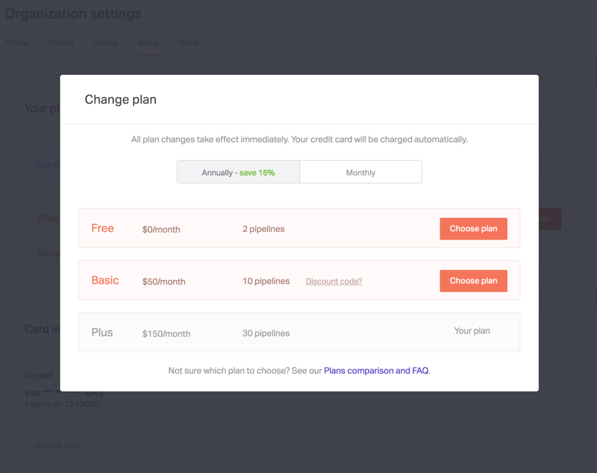

When you first login to your Dockbit organization you will be on _Free plan_. See the table below to see how the different plans differ from each other.

| Feature               | Free | Basic | Plus |
|-----------------------|:----:|:-----:|:----:|
| Metrics               |      | ✓     | ✓    |
| Queues                |      | ✓     | ✓    |
| Auto-deploys          |      | ✓     | ✓    |
| Permissions and teams |      |       | ✓    |
| Locks                 |      |       | ✓    |
| Confirmations         |      |       | ✓    |

## Upgrading

When you want to upgrade your plan, you'll just need to navigate to __Billing__ under __Organization settings__ and click on __Upgrade__. In the modal shown next, look for the plan you want to upgrade to and click on __Choose plan__.

