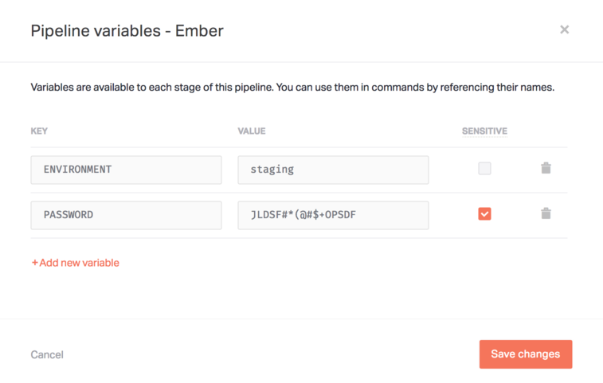
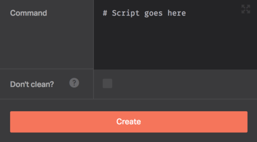
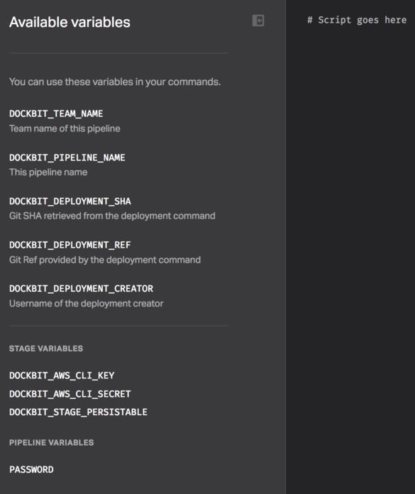

Environment variables (_env vars_ for short) are essential for building powerful and versatile deployment pipelines. It's no coincidence they're one of the core ideas in the modern methodology for building Web applications, see [12-Factor App](https://12factor.net/config).

Usage of _env vars_ varies a lot from one pipeline to another, but commonly they store the following:

 * Backing services (databases, message buses, etc) connection information.
 * Credentials to external services (AWS, etc).
 * Deployment-related values such as hostnames or environments.

## Pipeline variables

Pipeline Variables are available in every stage of the Pipeline. You can use them by referencing their names.

To create a Pipeline Variable, click on **Variables** while you're in the _Pipeline Editor_.

### Built-in variables

In addition to setting your own variables, Dockbit provides built-in Variables that can be very beneficial for deployment workflows.

| Name                       | Description                                        |
|----------------------------|----------------------------------------------------|
| DOCKBIT_TEAM_NAME          | Team name that created the Pipeline                |
| DOCKBIT_PIPELINE_NAME      | Pipeline name                                      |
| DOCKBIT_DEPLOYMENT_SHA     | Git SHA retrieved from the deployment command      |
| DOCKBIT_DEPLOYMENT_REF     | Git Ref provided by the deployment command         |
| DOCKBIT_DEPLOYMENT_CREATOR | Dockbit username of the deployment creator         |

### Sensitive variables

_Env vars_ are commonly used to store secrets and other sensitive information. If that's the case, you can tick the **Sensitive** flag and its value will be hidden to everyone on your team besides the _Admins_.

## Stage variables

Stage variables are only available for a single designated Stage of the Pipeline. They are usually used for configuring [Dockbit Integrations](/integrations).

A good example for a Stage variable is the [AWS S3 website](../../integrations/aws-s3-website). The _Secrets_ parameter is actually a Stage variable that is exported as `DOCKBIT_AWS_S3_WEBSITE_SECRET` during execution.

## Using variables

Now that you know about the types of the variables and their scopes, let's get to use them.

Dockbit provides a _Zen Mode_ that lets you focus on writing scripts with handy helpers for the defined variables. You can access it by clicking the **Expand** button in the Stage **Command** field.

Once you're in the _Zen Mode_, you can write deployment scripts and utilize the variables on the left, without having to leave the editor.

